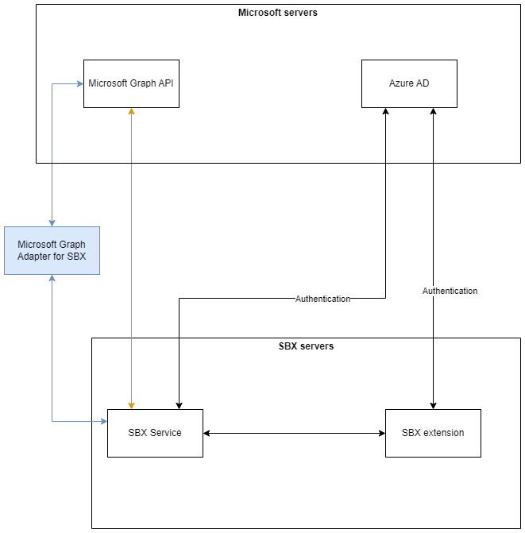

# Microsoft Graph Adapter For SBX

This is an optional proxy for Microsoft Graph API.
The adapter exposes only the subset of Microsoft Graph API methods and fields that are required for SBX to function.

## Why is it necessary?

Microsoft Graph API permissions cannot be controlled granularly by fields.
Thus, SBX must ask for many more permissions than it actually needs.
For example, to modify message categories SBX needs a Mail.ReadWrite permission which also gives SBX permission to read and write all email content.
This is an open source adapter that will remain under your company's control, so you can comfortably give it permissions for your email accounts.
It will grant to SBX by proxy exactly the permissions and fields SBX needs to function and allow you to know for sure SBX is not reading or modifying the content of your email.

## Who is it for?

This adapter is meant for the users of [SBX](https://sbx.tools/) which is a collaborative inbox for Outlook.
This adapter is not required, it is meant for companies whose policies do not allow them to give all the required permissions via Microsoft Graph API as they would be too permissive.

## How does it work?

This is a simple adapter that proxies a small subset of the Microsoft Graph API requests that are required for SBX to function.
For every request it also selects a subset of fields for the response.
This ensures that confidential fields like the message body are never sent to SBX's servers.
It also limits which fields can be modified via POST and PATCH requests.

## How to build the Docker container?

Run the following command
````bash
docker build -t microsoft-graph-adapter-for-sbx -f .\MicrosoftGraphAdapterForSbx\Dockerfile .
````
## How to configure and run the adapter?

Full instruction are [here](./docs/running-instructions.md).

In short, first, register an application in Azure Active Directory and give it access rights to Microsoft Graph API.
Then you can host the adapter API using your preferred method.
Set up a domain with SSL certificates.
And finally, use the SBX portal and select the option to have SBX use your adapter. 

## Diagram of the solution

### Without using the adapter
SBX communicates directly with Microsoft Graph API (orange line) and thus requires application permissions for Microsoft Graph API.

### With the adapter
SBX communicates with the Adapter API (blue line) and does not require Microsoft Graph API permissions.
Instead, the adapter requires Microsoft Graph API permissions and SBX needs access to the adapter.

