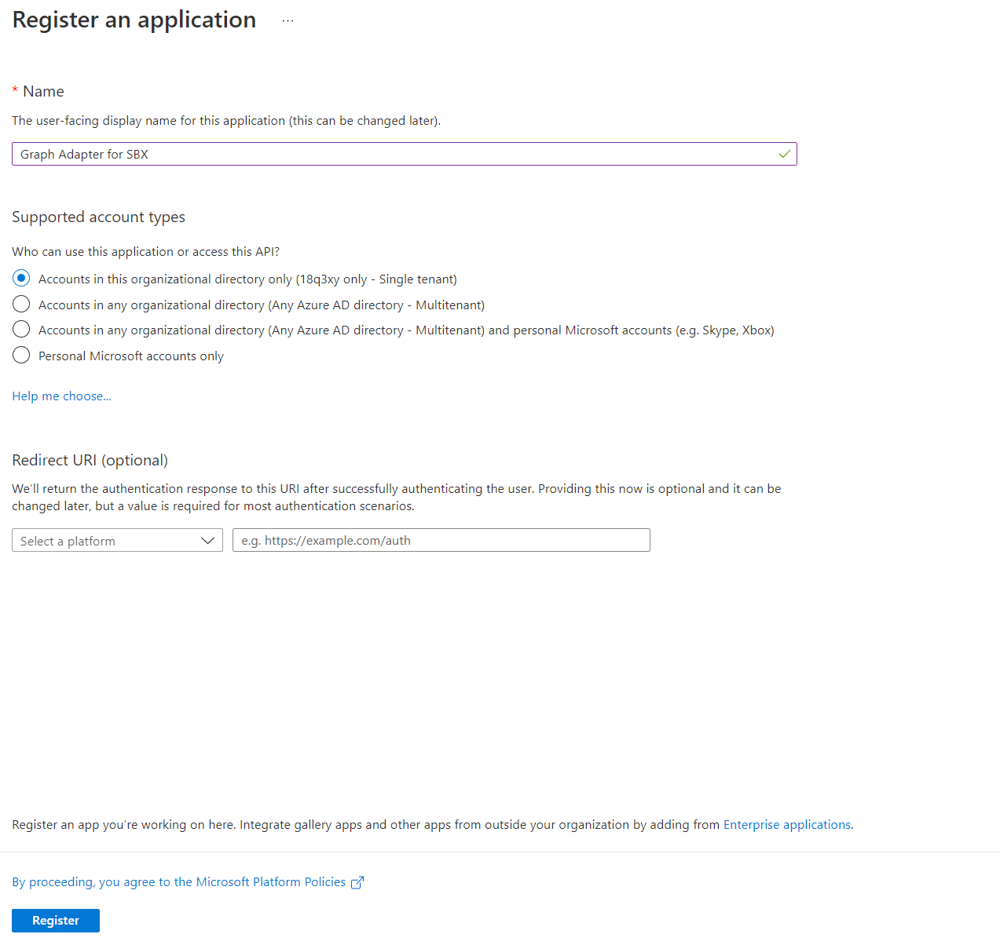
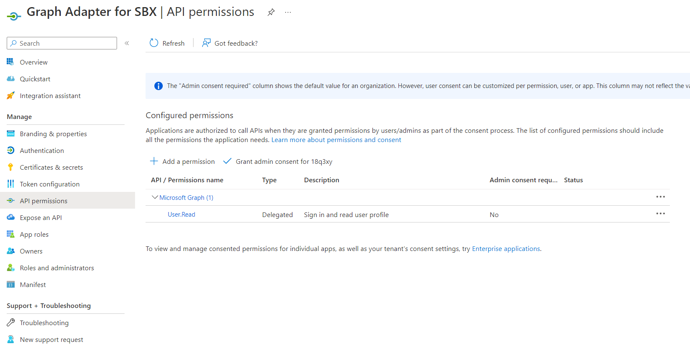
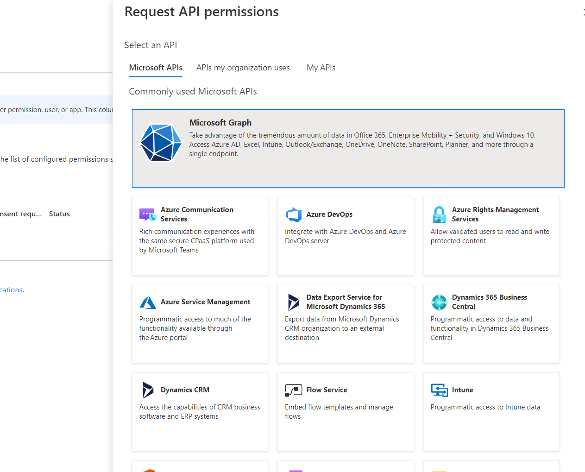
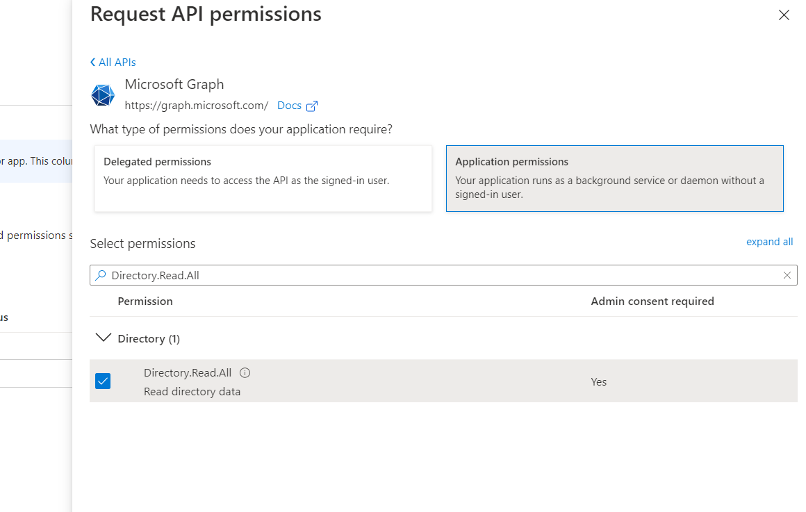
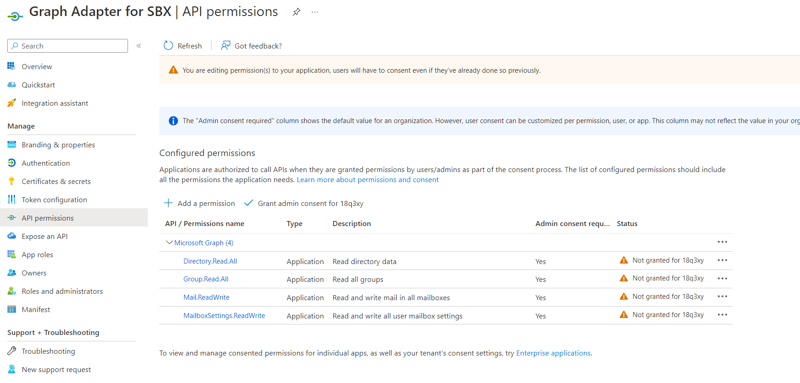
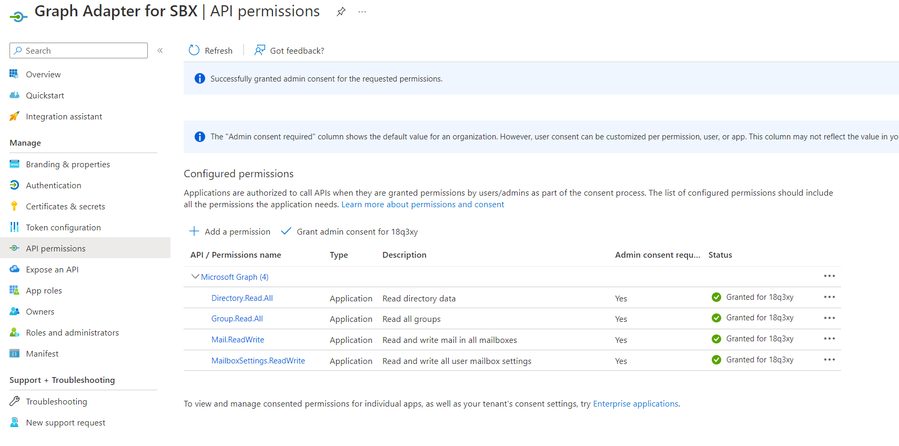
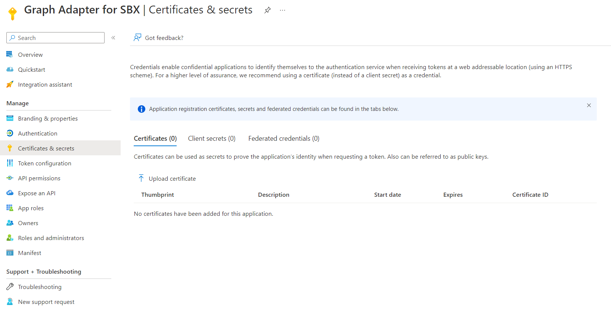

# Microsoft Graph permissions

Graph Adapter is an open source API that gives you full transparency over what data is sent to SBX.

To use it, you must give it access rights to Microsoft Graph API.

## Setting up the graph adapter

1) Register a new app
    -  Go to Microsoft Azure Portal -> Azure Active Directory -> App registrations
        - [Link](https://portal.azure.com/#view/Microsoft_AAD_IAM/ActiveDirectoryMenuBlade/~/RegisteredApps)
    - Select "New Registration"
    - Enter a name for the registration
    - In "Supported account types" select "Accounts in this organizational directory only (Single tenant)" - should be the default value
    - Leave "Redirect URI" empty  
      
    - Click "Register"
2) Give Microsoft Graph API permissions to the created app
    - Last step automatically opened the registered app
    - Select "API permissions" (from left side menu, under "Manage")
      
    - Click "Add a permission"
      
    - Select "Microsoft Graph"
    - Select "Application permissions"
    - Using search select the following permissions:
        - Directory.Read.All
          
        - Group.Read.All
        - Mail.ReadWrite
        - MailboxSettings.ReadWrite
    - After you have selected all of them, click "Add permissions"
      
    - The "User.Read" permission is there by default, you may remove this by clicking the three dots and then "Remove permission". As Graph Adapter only uses Application permissions, the "User.Read" is not necessary.
    - Click "Grant admin consent for ..."
    - If all statuses are "Granted for ..." then everything is correct
      
3) Upload certificate for access rights
    - Select "Certificates & secrets"
      
    - Click "Upload certificate"
    - Select your certificate public key and press "Add"
4) Fill required settings
    - Graph Adapter for SBX has "appsettings.json" file for configuration. It has 2 important sections
        1) GraphSettings - used for communicating with Microsoft Graph API using the permissions and certificate created in previous steps. Fill in all the values with your information.
            - ClientId - find it under your app registration -> Overview -> Application (client) ID
            - TenantId - find it under your app registration -> Overview -> Directory (tenant) ID
            - CertificatePath - path to the private key of the certificate that you uploaded at previous step
            - CertificatePassword - password for the certificate (leave empty if no password)
        2) SbxSettings - used to allow SBX to access this adapter. These settings must be left as they are.
5) Use your own preferred solution to host the adapter on a https domain.
6) Set up SBX to use your graph adapter
    - Go to SBX portal -> Company Settings -> Graph Adapter
    - Select "Use own graph adapter"
    - Enter your Graph adapter url
    - Before saving make sure it is working by clicking "Validate url" button
    - If validation succeeded, click "Save changes"